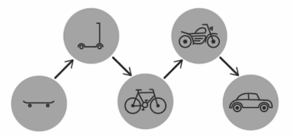

### EXECUTIVE SUMMARIES

An executive summary (also called a management summary) is a short document that is created for various business purposes. Executive summaries can be used to outline longer reports or to summarize large proposals.

The purpose of executive summaries is to provide brief overviews that allow readers to become familiar with the overall data much more rapidly (as opposed to reading longer reports in full).

The origin of the term comes from the fact that teams were provided with summaries by executives for rapid decision making and project approvals. Executive summaries are still commonly used for this purpose.

Executive summaries are sometimes used in project management to provide snapshots of various projects and proposals.

Let’s take a look at how to convey the purpose of a project.

### BUSINESS CASES

A business case is a description of the reasons for starting a project or tasks. The “why” for a particular project is its business case.

Business cases should include the specific business need behind the project and the benefits that it brings. They can be written or conveyed verbally. In addition to the reasons why and the benefits, business cases can include:

● The various options associated with the project.
● The cost of the project.
● The expected risks connected to the project.

Another element of business cases can be a “gap analysis”. A gap analysis is a comparison between current performance and the potential or desired performance.

To summarize, a thorough business case for a project includes: the reasons behind it, associated risks, benefits, various options or approaches, an executive summary, and a gap analysis.

Sometimes when writing code, there are better ways of doing certain things. Let’s cover the word for that.

### REFACTORING CODE

Refactor means to rewrite code with the purpose of improving its structure and readability, without changing its behavior.

Streamlining your code, cleaning it up, or making it more concise could all be considered refactoring.

Let’s say you created a script (a program that automates something) that scanned websites for company phone numbers. Your program is made up of 250 lines of code. You go through your code and you’re able to decrease your total lines of code to 100, while still maintaining the initial purpose of your script, and possibly getting it to perform faster – that would be refactoring.

“Production code” refers to live code that users interact with. For example, the Facebook app you see on your phone is production code. This is as opposed to code that is being tested or hasn’t been deployed yet. Typically, refactoring occurs with production code. Meaning, the code is refactored and re-released in better form.

### TESTING

Quality assurance (abbreviated QA) simply refers to ensuring that standards are maintained – it is literally actions taken to assure quality. In coding, it means the same thing. QA are actions that make sure that software performs as expected.

The main component of QA is testing. Testing software is the process of putting the software through various tests to attempt to locate bugs that need to be fixed.

A bug is an error in a computer program that impairs or prevents its operation. A bug could slow something down on your computer or stop it altogether. Some say this term came from incidents during the early days of computers where actual bugs (insects) got inside the computer and caused malfunctions.

QA and testing are intrinsic elements of project management.

There’s actually software that can automate the process of testing. This QA software can test some of the software for you and provide you with detailed reports on potential issues.

Acceptance testing is a form of quality assurance that tests software to see if it complies with the project requirements. The purpose is to determine whether or not the product is ready for delivery (completion).

Unit testing is a way to test software where individual units (individual parts) of code are tested as opposed to the entire software all at once. These units of code are categorized by setting related sections of the computer program together and running them through various tests.

A unit test is a short program that checks the results of and tests various units of code.

They are valuable because they can detect when refactoring code has resulted in the code not working as originally designed.

Another form of testing is usability testing. This tests how easily software can be utilized by users.

Here are some of the points evaluated in usability testing:

● What is the level of skill required to learn and use the software?
● How long does it take to begin using the software?
● What is the user’s attitude toward the software?
● How does the user respond to the software under realistic conditions?

Usability testing can be used for these reasons:

The purpose of QA and testing is to ensure that the project is a success. So, how do you gauge the potential success of a project?

### FEASIBILITY STUDY

“Feasible” means “workable; realistic; possible”.

A feasibility study is a review of how practical a proposed project is. The purpose is to analyze the strengths and weaknesses of a project. This includes confronting the various opportunities and threats, the required resources, and how likely success is.

The primary points that are reviewed in feasibility testing are:

1. The required cost of the project, and
2. The value attained by completing the project.

Feasibility studies can provide a historical background of the company or project, a description of the proposed project or service, financial information, details about various activities, market research, and legal requirements.

Feasibility tests are supposed to be unbiased and provide a realistic view of the potential of success.

### STAKEHOLDERS

A stakeholder is someone involved in a project that is concerned with its overall success.

The origin of the word is “a person involved in a bet”.

In project management, a stakeholder is simply anyone interested in a project’s outcome. This can include members of the team, executives, users and clients.

Stakeholders are the people affected by the outcome of a project and those who can influence it.

### MVPs

Viable literally means “able to survive” and refers to something that can operate successfully.

A Minimum Viable Product (abbreviated MVP) is a version of a product with just enough features to satisfy early customers and provide feedback for future product development.

It is not a completed project but can be used to show basic functions.

For example, an MVP app may be able to produce some basic actions but might not look aesthetically pleasing yet.

### PROJECT CHARTERS

A “charter” is a written description of something – such as an explanation of a company’s functions.

A project charter is a statement about the scope (size and range), goals and participants (people involved) in a project. It is written before the work begins on a project and covers the following:

1. A description of various positions and their associated
responsibilities.
2. Outlines of the main goals of the project.
3. Identifies the primary stakeholders.
4. Defines the role, duties and responsibilities of the project manager.

Project charters can be used to gain authorization on a project or provide a point of focus for the project that can be referred back to later.

### LEAD TIME

Lead time is how much time has passed since the client initially ordered the project and the completion of the project. It is the amount of time between project requirements and their fulfillment.

Here’s how lead time could apply to ordering food at a restaurant:

Lead time is used in another related way in project management. It applies when you have two tasks that have a dependency – that is, one task requires some or all of the work involved in the other task to be completed before it can be started.

In this use, lead time means “the amount of time between the start of one activity and the start of a second activity dependent on the first”.

A project manager might use this idea in setting a time schedule for various tasks to be completed – for example, they might need to push the launch date of a new web site two weeks out into the future because that is how long it will take for the shipping, arrival and setup of the computer that the web site will be installed on. Here, the “lead time” of the web site installation is two weeks, since we have to wait that long before we can start that task.

