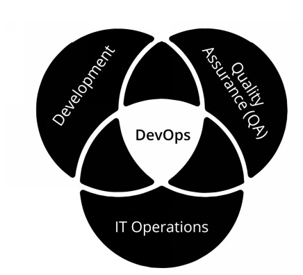
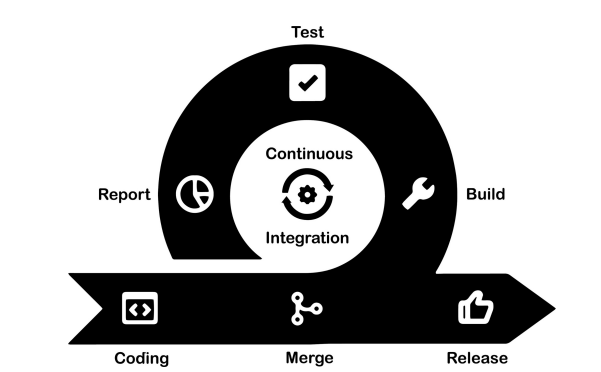
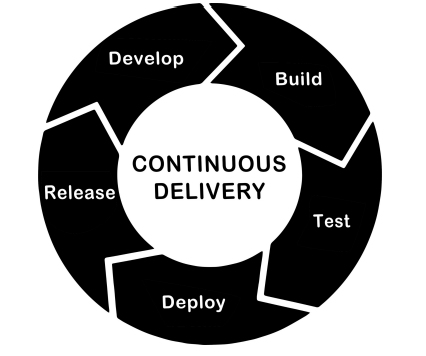
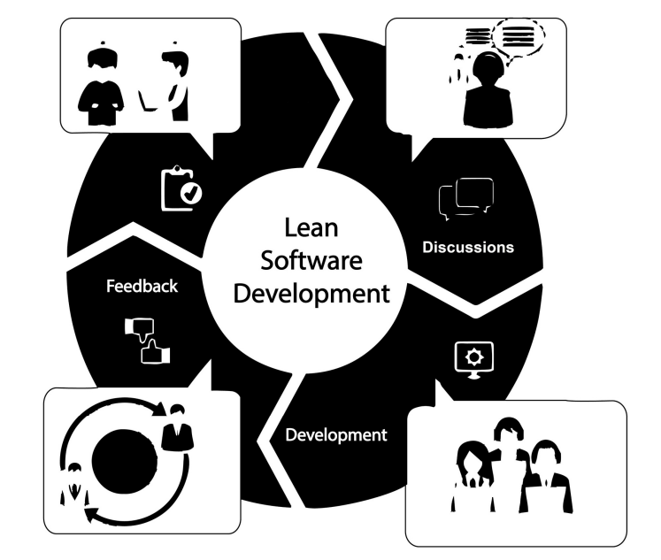
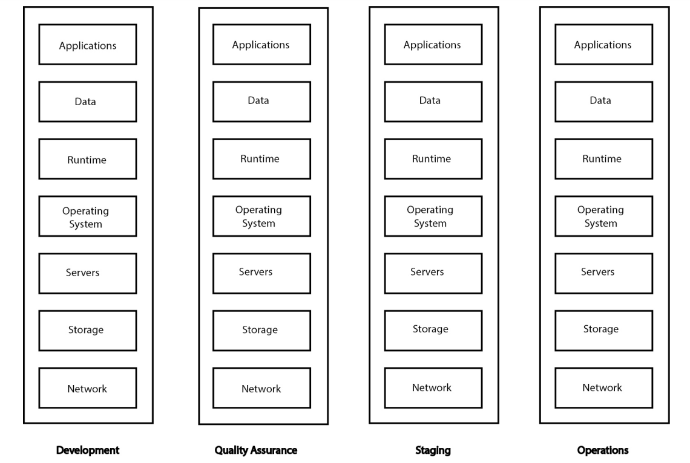

DevOps stands for Development and Operations. In technology companies, there are various departments or divisions. Two of these are:

1. Development – the staff that write the code.
2. Information Technology Operations Department (also called I.T. Operations, I.T. Department, Operations Department or just Operations) – the staff that handle information technology operations. Such I.T. operations include: managing the computer systems that hold the actual programs used by the customers, handling emergency situations where there are interruptions in service in the company’s computer programs, and handling customer service. The Operations Department also typically oversees the company’s computer network, technical support and other non-coding, yet technological, functions.

DevOps is a business practice, rather than a division of the organization; it combines the actions of these two departments and works to establish a high degree of coordination and cooperation throughout a company.

Another element of DevOps is constant testing – referred to as Quality Assurance (QA).

The purpose of DevOps is to speed up the development and improvement of high-quality software.

“CI” stands for “Continuous Integration”.

Continuous integration is an approach to software development and a set of practices that encourages developers to implement small changes and check-in (upload) code to version control (software for managing different versions of code) repositories (storage) frequently.

This code is collected together in a set of computer files called a “repository”. At any point, this code can be converted into an actual computer program that can be run on a computer; that process is called “building” the program, or “creating a build” of the program.

Each time developers merge their code changes into a central repository, CI includes ensuring automated builds and tests are run on the code in the repository.

This is as opposed to not checking in code often or not testing code after every push (an update made to code that is uploaded for review or deployment).

CI is a component of DevOps.

“CD” stands for “continuous delivery”. It is another element of DevOps.

CD encourages that development teams produce software in short cycles. CD automates the delivery of applications to environments (a computer system where computer programs are executed and deployed). Since teams sometimes work with multiple environments (such as testing and development), CD ensures that there is an automated way to push code changes to the applicable environment.

CI and CD include continuous testing to ensure that the end product that is delivered to users has no errors.

CI/CD are commonly used together to refer to the following:

● DevOps is being utilized

● Software is being developed by a team

● Each stage of the process is separated into different environments

● Only small changes are made

● Every change is checked in

● Every step is fully tested before moving forward

There is another approach to software development that we will now cover to enhance your understanding of DevOps.

## LEAN DEVELOPMENT

Lean manufacturing is a methodology that focuses on minimizing waste while maximizing productivity. Some points that are monitored to prevent waste include:

● Overproduction (creating more than is necessary)

● Wasted time (such as waiting)

● Too much inventory (more in stock that what is needed)

● Errors and defects (imperfections; shortcomings)

Lean manufacturing avoids wasted time, actions, motion, supplies, etc. It attempts to achieve as much production as possible through using as little as possible.

This applies to software development. In lean development, one attempts to develop software as efficiently as possible through the same basic principles.

Some of the principles of lean development include:

a. Eliminating waste

b. Enhancing and increasing learning

c. Delivering as quickly as possible

d. Empowering the team

Lean is commonly used in conjunction with Agile because the two subjects mesh well. In fact, sometimes the two terms are used together like Lean-Agile. This simply means that both methodologies are being utilized.

Here’s how it relates to DevOps: DevOps represents a change in IT culture focusing on rapid IT delivery through the adoption of Agile-Lean practices. One of the elements of Lean practices is the rapid iterative feedback that you get throughout the entire chain of processes which result in a final product.

In other words, each time something is created, feedback is gathered immediately when something goes wrong (or is about to go wrong) so that you can adjust your operation very rapidly in a very agile manner.

## PURPOSES OF DEVOPS

DevOps focuses on the need for developers and I.T. operations to work closely together to achieve common goals.

Be aware that DevOps is a relatively new discipline and exiting definitions may differ. In general, it’s a combination of cultural philosophies, practices, and tools that increase an organization's ability to deliver applications and services at a high velocity. This means evolving and improving products at a faster pace than organizations using traditional software development and infrastructure management processes.

This speed enables organizations to serve their customers better and compete more effectively in the market – specifically, by increasing the velocity at which developers can actually deploy their code, their programs, and being able to improve at a faster pace.

An essential element of DevOps is that there’s a change in culture. It's not necessarily about the tools.

DevOps emphasizes people and culture . It seeks to improve collaboration between operations and development teams. DevOps implementations utilize technology, especially automation tools.

DevOps came into use by capturing the minds of people outside the core development team: people in operations, people in marketing, people in supply and inventory. All these different elements of an organization, they started to look at them like, “Well, wait a minute. What if we all cooperated? What if we all looked at the organization as a whole rather than just from our one point of view?”

An important element of DevOps is communication and collaboration . A successful DevOps program is a transition in culture that moves away from isolated silos (detached operating environments) and towards a collaborative, cooperative organization. You can get tools that help implement this, but when you get right to it, it's a human process. It involves people being willing to communicate with other elements of the organization. DevOps is all about working with others to really understand their point of view, what's important to them, and getting them to understand what's important to you. It's a genuine collaboration so that at the end of the day, the customer is satisfied.

Another characteristic of DevOps is how various components of development are separated into different environments.

## ENVIRONMENTS

One thing to examine is the fact that software development involves several different environments.

An environment is a computer system where computer programs are executed and deployed.

An example of an environment is developing and executing a program on a single machine (such as your laptop). Environments range in size from the single machine just mentioned, to networks of multiple, separate servers (large computers used to store and transmit data). An environment is the overall structure within which a user, computer, or program operates.

In some companies, the following environments are used:

● Development environment – this is where all the coding occurs

● Quality Assurance environment – this is where the code is tested by other developers

● Staging environment – this is where review of the software is done before it is delivered to users

● Production environment – this is the live software that users can access

As you may have guessed, the above environments are actually a sequence that the software moves through. Once a stage is complete, the code is passed along to the next stage. If rejected, it moves back for corrections – if accepted, it moves forward.

Now, there are a couple of terms in the above picture we need to define. Let’s start with runtime.

Run means to start or execute something.

A compiler is a special program that converts the code that looks nearly English, into a form that the computer can understand and operate off of. The product of a compiler would be a set of instructions for the computer to execute that would end up doing what the “nearly English” code described.

Runtime means the time when something in the computer is running. Runtime is exactly what it sounds like – the time when the program is run. You can say something happens at runtime or it happens at compile time.

The term runtime has another, slightly different meaning - one that involves two different types of computer programs. Specifically, it relates to the situation where a custom software program (the kind this whole book is written about) is deployed on a computer for use. Often, that computer program is written in a language that needs some additional help interacting with the core parts of the computer it is on - to do things like access files on the machine, or interact with the various input and output devices attached to the computer, for example. This is accomplished by using another type of computer program that acts as a “bridge” or coordinating element between the computer code in the custom software and the computer code in the operating system on that computer.

That kind of program is called a “runtime library”, or “runtime” for short. This program would start up as soon as the computer is turned on and remain running continuously. This way, when technology workers deploy their custom software to that computer, it can actually operate on the computer. One way to think of it is “here is a program that can be used by YOUR program when your program is running.”

There are runtime libraries for many of the most popular
programming languages used to create modern computer programs. Like
most programs, these libraries are usually continuously maintained and
upgraded.

An operating system is a special-purpose computer program that supports the computer’s basic functions, such as scheduling tasks, running other computer programs, and controlling peripherals (external devices such as keyboards, mice and displays).

Most computer programs will require that an operating system already be installed on a computer before they can function on that computer.

Nearly all computers available today come with an operating system already installed when they are purchased. Computer manufacturers install the operating system before they sell a computer.

Some operating systems are free; others are available for a fee.
 
One of the most well-known and popular operating systems in the world is called Windows. It is created and sold by the technology company Microsoft.

Other popular operating systems are:

● OS X (created by the technology company Apple – it is used on their desktop computers and laptops)

● Linux (a family of free and for-fee operating systems – it is used on desktop computers and laptops)

● Android (owned by the technology company Google – it is used on mobile devices like smartphones)

● iOS (created by Apple – it is used on their mobile devices like the iPhone and iPad)

A staging environment (stage) is a nearly exact copy of a production environment (the actual code composing a product) for software testing. Staging environments are made to test code and to ensure quality before deploying software. Everything in a staging environment is as close of a replica to the production environment as possible to ensure the software works correctly.

Now that we know those terms, let’s look at the diagram again:

Each of these upright rectangles represents an environment. These environments are kept separate and as chunks of software are completed, they are moved from left to right. Errors are sent back to earlier environments so that fixes can be made. The efficient management of this arrangement, so that viable software is delivered often to satisfied users, is a major aspect of DevOps, and many of the tools you’ll find for DevOps relate to how to do this.

